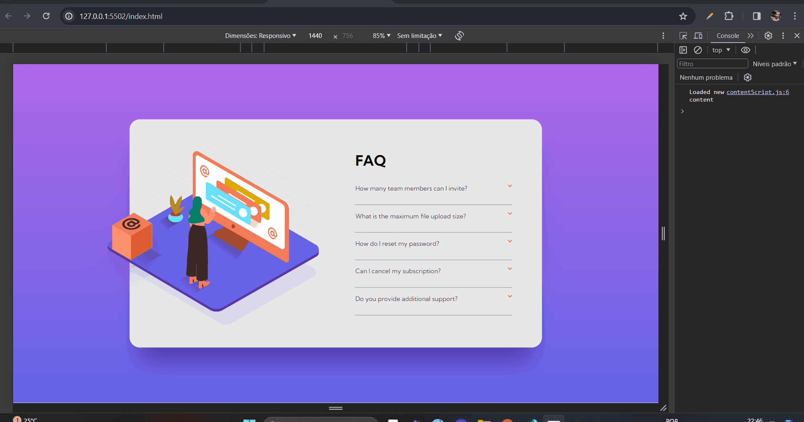

# faq-accordion-card-main

<br>



<br>

Esse o um dos meus primeiro projetos, do Frontend Mentor, envolvendo uma liguagem de programação ``` Javascript ```. Nele criei um acordeon com as opções de um FAQ.

Ao clicar em um tópico será mostrada uma resposta para a questão. Além disso, o tópico fica em uma fonte com peso maior e a seta da cor laranja fica invertida, indicando que aquele tópico está selecionado.

Para criar a lógica de programação eu criei estilos a serem adicionado ou removido usando um evento de click, dentro de um <i>forEach</i>, em cada item da lista.

## Linguagens Utilizadas:

- HTML;
- CSS;
- Javascripr;
